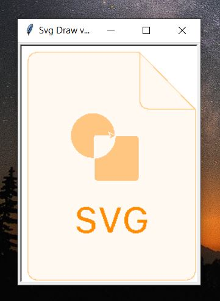
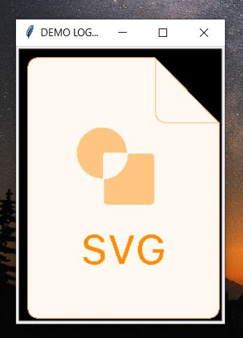
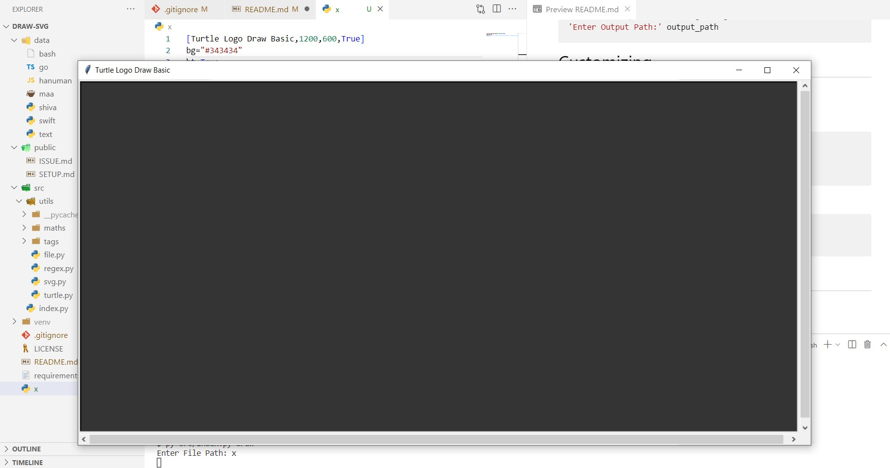

<p align="center">
	
	<h2 align="center">DRAW SVG</h2>
</p>

<p align="center">
Minimal SVG using Python Turtle
</p>

<p align="center">
	<a href="version">
		
	</a>
    <a href="link to license">
		
	</a>
	<a href="link to license">
		
	</a>
</p>

<br/><br/>


# Getting Started 🐢
- [Setup](#setup-%EF%B8%8F)
- [Running Command](#running-command-)
- [Convert SVG to Python Turtle](#convert-svg-to-python-turtle-)
- [Customizing](#customizing-)
- [Shape Generation](#shape-generation-)
- [Unsupported](#unsupported-%EF%B8%8F)

<br/>

# Setup ⚙️

## Git Clone

```cmd
git clone https://github.com/sandeep-shaw10/draw-svg.git
cd draw-svg
```

## Set Virtual Environment

```cmd
python -m venv venv
```

## Activate Virtual Environment

```cmd
source venv/Scripts/activate
```

## Install Dependency

```cmd
pip install -r requirements.txt
```

<br/>

# Running Command 🤖

## `➡️ python src/index.py draw`
```py
# Draw from the existing Decoded file
'Enter File Path:' data/bash
```


## `➡️ python src/index.py decode`
```py
# Convert the SVG file into Decoded File
'Enter SVG Input Path:' target.svg
'Enter Output Path:' output_path
```

## `➡️ python src/index.py run`
```py
# It creates and draw the file together
'Enter SVG Input Path:' target.svg
'Enter Output Path:' output_path
```

<br/>

# Convert SVG to Python Turtle 🔄

Suppose we want to apply python turtle on a given svg file inside `public` directory

[](./public/demo.svg)

**1. Run the source program**

```cmd
python src/index.py run
```

**2. Enter the Location of target svg**

```cmd
public/demo.svg
```

**3. Enter the path of Output File** *(Creates a new files and if already exist then it throws an error)*

```cmd
demo
```

**4. A file with name `demo` is created with contents as**

```py
[Svg Draw v1.0,240,320,False]
path={'d': 'M228 319.5H12C5.64873 319.5 0.5 314.351 0.5 308V12C0.5 5.64873 5.64873 0.5 12 0.5H159.175C159.571 0.5 159.952 0.656748 160.233 0.936021L239.057 79.2681C239.341 79.5497 239.5 79.9326 239.5 80.3321V308C239.5 314.351 234.351 319.5 228 319.5Z', 'stroke': '#FFC681', 'stroke-width': 1, 'fill': '#FFF9F2', 'steps': 100}
path={'d': 'M160.5 1.20711L238.793 79.5H172C165.649 79.5 160.5 74.3513 160.5 68V1.20711Z', 'stroke': '#FFC681', 'stroke-width': 1, 'fill': '#FFF9F2', 'steps': 100}
path={'d': 'M68.8438 244.072C69.1738 250.699 74.7344 254.914 83.1387 254.914C92.0254 254.914 97.5352 250.496 97.5352 243.387C97.5352 237.826 94.4121 234.729 86.9727 233.027L82.7578 232.062C78.2129 230.996 76.3594 229.549 76.3594 227.035C76.3594 223.861 79.1523 221.779 83.3672 221.779C87.3789 221.779 90.2227 223.836 90.6797 227.111H96.9512C96.6465 220.84 91.0859 216.447 83.3926 216.447C75.1914 216.447 69.7578 220.865 69.7578 227.467C69.7578 232.9 72.8809 236.176 79.5332 237.699L84.2812 238.791C88.9785 239.883 90.9844 241.508 90.9844 244.174C90.9844 247.297 87.8613 249.557 83.5449 249.557C78.8984 249.557 75.6484 247.424 75.2422 244.072H68.8438Z', 'stroke': 'white', 'stroke-width': 1, 'fill': '#FF8C02', 'steps': 100}
path={'d': 'M121.59 254L134.26 217.361H127.278L118.137 246.51H117.705L108.489 217.361H101.252L114.049 254H121.59Z', 'stroke': 'white', 'stroke-width': 1, 'fill': '#FF8C02', 'steps': 100}
path={'d': 'M170.731 239.375V234.805H155.522V239.807H164.333L164.307 240.568C164.206 245.748 160.397 249.227 154.811 249.227C148.286 249.227 144.198 244.047 144.198 235.617C144.198 227.314 148.21 222.135 154.608 222.135C159.305 222.135 162.581 224.471 163.901 228.711H170.426C169.258 221.246 163.063 216.447 154.608 216.447C144.173 216.447 137.495 223.938 137.495 235.668C137.495 247.525 144.096 254.914 154.71 254.914C164.485 254.914 170.731 248.846 170.731 239.375Z', 'stroke': 'white', 'stroke-width': 1, 'fill': '#FF8C02', 'steps': 100}
path={'d': 'M99 117C96.7909 117 95 118.791 95 121V148.939C94.3386 148.979 93.6717 149 93 149C75.3269 149 61 134.673 61 117C61 99.3269 75.3269 85 93 85C110.673 85 125 99.3269 125 117H99ZM125 117H155C157.209 117 159 118.791 159 121V177C159 179.209 157.209 181 155 181H99C96.7909 181 95 179.209 95 177V148.939C111.741 147.906 125 134.001 125 117Z', 'stroke': 'white', 'stroke-width': 1, 'fill': '#FFC681', 'steps': 100}
```

**5. Output**



**6. Customization**

We can further enhance the python turtle by adding some basic command to the `demo` file. 
Customization is discussed elaborately in this section [here](#customizing).

```py
[Svg Draw v1.0,240,320,False]
+ speed=0
+ bg="black"
path={...}
path={...}
path={...}
path={...}
path={...}
path={...}
+ title="DEMO LOGO ..."
+ ht=True
```
_**Ignore '+' while copying_

This will customization will
- Increase the speed of turtle
- Change the background to black
- Change the title to "Demo Logo ..." at last
- Hide the Turtle at last

If we want to decrease the time speed in curve then decrease the attribute of `steps` in path.


```py
# Slow Curve 
path={ ... steps:100 }

# Decrease steps to draw fast curve
path={ ... steps:10 }
```

Chack the `path` section in [Shape Generator](#shape-generation)

| Steps | Time | Smoothness |
| --- | --- | --- |
| High | slow | fine|
| Low | fast | rough |

**7. After editing and saving the `demo` file, we need to run the existing file with command `draw`**

```cmd
python src/index.py draw
```

**8. Enter the path of the decoded file `demo`**

```cmd
demo
```

**9. Output**

[](./public/demo_py2.jpg)

<br/>

# Customizing 🔧

## Basic Turtle Window Generation

Create a file say `example`

```txt
[Turtle Logo Draw Basic,1200,600,True] 
bg="#343434"
ht=True
```

Run the command

```sh
python src/index.py draw
Enter File Path: example
```

Output



## Decoded File Format

First Line
```py
[<initial title>,<width>,<height>,<True || False>]
# No spaces between comma(',') and no (" , ')
# True => Hide on Click
# False => Hide on Button Close
```

Appearance Commands
```py
# Changes Background Colour
bg="#343434"

# True: Hide Turtle | False: Show Turtle
ht=True

# Set the Title of the Turtle Window
title="Drawing Complete"

# Set the Speed of Turtle
# Turtle’s speed range (0-10).
# Speedstrings  are mapped to speedvalues in the following way:
## ‘fastest’ :  0
## ‘fast’    :  10
## ‘normal’  :  6
## ‘slow’    :  3
## ‘slowest’ :  1
speed=0
```

<br/>

# Shape Generation 🔶

Shapes Drawing Command: `line`, `polyline`, `polygon`, `rect`, `circle`, `path`, `text`

### Lines

```svg
<svg height="210" width="500">
  <line x1="0" y1="0" x2="200" y2="200" stroke="red" stroke-width="2" />
</svg>
```

```py
[Svg Draw v1.0,500,210,False]
line={'x1': 0.0, 'x2': 200.0, 'y1': 0.0, 'y2': 200.0, 'stroke': 'red', 'stroke-width': 2.0}
```

### PolyLine

```svg
<svg height="200" width="500">
  <polyline points="20,20 40,25 60,40 80,120 120,140 200,180"
  stroke="black" stroke-width="3" />
</svg>
```

```py
[Svg Draw v1.0,500,200,False]
polyline={'points': '20,20 40,25 60,40 80,120 120,140 200,180', 'stroke': 'black', 'stroke-width': 3.0}
```

### Polygon

```svg
<svg height="210" width="500">
  <polygon points="200,10 250,190 160,210" 
  fill="lime" stroke="purple" stroke-width="1" />
</svg>
```

```py
[Svg Draw v1.0,500,210,False]
polygon={'points': '200,10 250,190 160,210', 'stroke': 'purple', 'stroke-width': 1.0, 'fill': 'lime'}
```

### Rect

```svg
<svg width="400" height="110">
  <rect width="300" height="100" 
  fill="cyan" stroke-width="3" stroke="black" />
</svg>
```

```py
[Svg Draw v1.0,400,110,False]
rect={'x': 0, 'y': 0, 'width': 300.0, 'height': 100.0, 'stroke': 'black', 'stroke-width': 3.0, 'fill': 'cyan'}
```

### Circle

```svg
<svg height="200" width="200">
  <circle cx="50" cy="50" r="40" 
  stroke="black" stroke-width="3" fill="red" />
</svg>
```

```py
[Svg Draw v1.0,200,200,False]
circle={'cx': 50.0, 'cy': 50.0, 'r': 40.0, 'stroke': 'black', 'stroke-width': 3.0, 'fill': 'red'}
``` 

### Path

```svg
<svg height="600" width="800">
    <path 
		d="M567.781 162.304L420.104 74.7733C411.525 69.6852 401.73 67 391.752 67C381.773 67 371.979 69.6852 363.4 74.7733L215.713 162.304C206.936 167.535 199.673 174.957 194.639 183.841C189.604 192.724 186.972 202.763 187.001 212.971V388.032C186.947 398.216 189.542 408.239 194.533 417.121C199.523 426.003 206.738 433.438 215.47 438.699L363.138 526.229C371.716 531.316 381.509 534 391.485 534C401.462 534 411.254 531.316 419.833 526.229L567.538 438.699C576.268 433.436 583.48 426 588.469 417.119C593.458 408.237 596.052 398.215 595.998 388.032V212.971C596.081 202.813 593.527 192.806 588.585 183.926C583.644 175.047 576.483 167.597 567.8 162.304H567.781V162.304Z"
    	stroke="green" 
		stroke_width="1" 
		fill="lime" 
		steps="10"
	/>
</svg>
```

```py
[Svg Draw v1.0,800,600,False]
path={'d': 'M567.781 162.304L420.104 74.7733C411.525 69.6852 401.73 67 391.752 67C381.773 67 371.979 69.6852 363.4 74.7733L215.713 162.304C206.936 167.535 199.673 174.957 194.639 183.841C189.604 192.724 186.972 202.763 187.001 212.971V388.032C186.947 398.216 189.542 408.239 194.533 417.121C199.523 426.003 206.738 433.438 215.47 438.699L363.138 526.229C371.716 531.316 381.509 534 391.485 534C401.462 534 411.254 531.316 419.833 526.229L567.538 438.699C576.268 433.436 583.48 426 588.469 417.119C593.458 408.237 596.052 398.215 595.998 388.032V212.971C596.081 202.813 593.527 192.806 588.585 183.926C583.644 175.047 576.483 167.597 567.8 162.304H567.781V162.304Z', 'stroke': 'green', 'stroke-width': 1, 'fill': 'lime', 'steps': 10}
```

Important:
1. Wont work for `A`, `Q`, `T` and `S`
2. Additional `steps` (integer attribute) to specify smoothness of curve making it draw *faster*

### Text

```svg
<svg width="200" height="200" xmlns="http://www.w3.org/2000/svg">
  	<text 
		x="65" y="55" 
		fill="red" 
		font-size="20" 
		font-family="sans-serif" 
		font-style='italic'
	>
		Grumpy!
	</text>
</svg>
```

```py
[Svg Draw v1.0,200,200,False]
text={'x': 65.0, 'y': 55.0, 'font-size': 20, 'font-family': 'sans-serif', 'font-style': 'normal', 'fill': 'red', 'data': 'Grumpy!'}
```

<br/>

# Unsupported ⚠️

- [ ] Float dimension
- [ ] `fill: none`
- [ ] Some Regex related issue for 
    - d="...." in path grabbing the id="xxx" (Removing `id` in path may solve the problem)
    - In `d` of path tag some paths pattern may fail to generate result (Solving...) 
- [ ] Rounded rectangle
- [ ] Curves: `A`, `Q`, `T` and `S`
- [ ] `Ellipse`
- [ ] Working with Group `<g>...</g>` to add the attributes of group into each child member 
- [ ] Use of Class base and Inline Styling
- [ ] Only works with hexadecimal and name color. `rgb`, `rgba` and `hsla` not work
- [ ] Other unsupported Attributes: `viewbox`, `clip-rule`, `fill-rule`, `style`


<br/>

# Authors ✒️

- [@sandeep-shaw10](https://www.github.com/sandeep-shaw10)
